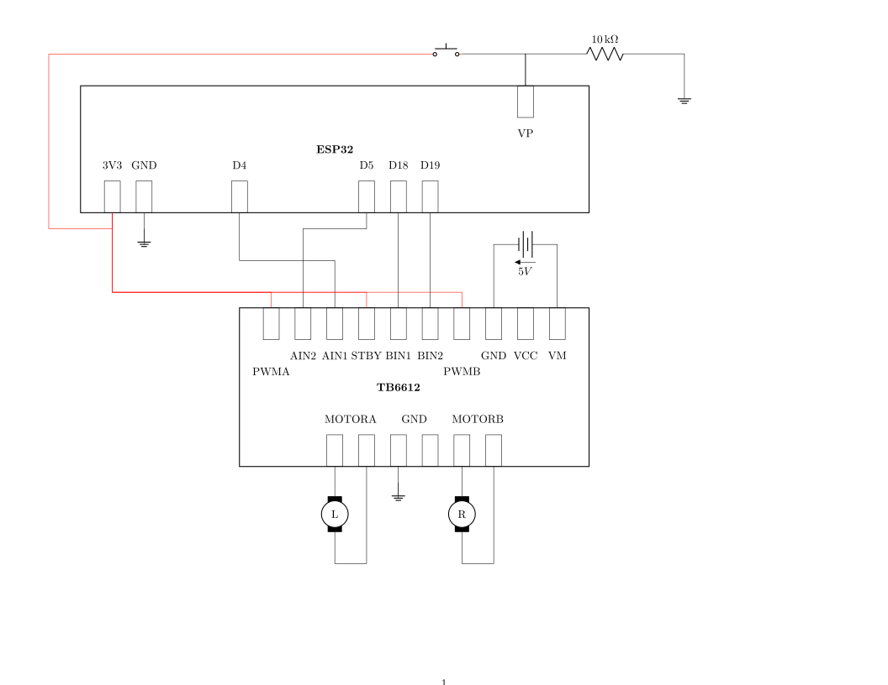

Motor Test:

Use with 
 * ESP32
 * Adafruit TB6612 1.2A DC/Stepper Motor Driver Breakout Board
 * 2x brushless DC motor (5V)
 * 5V battery pack
 * push button

The motors are connected to the motor controller. The button is connected to the ESP. When the program starts, the motors both run forward. When the button is pushed and held, the motors run backward.
 
 
